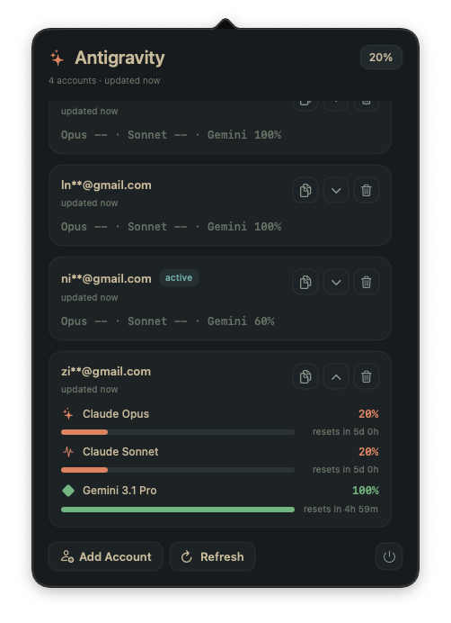

# AntigravityBar

AntigravityBar is a small macOS menu bar app that shows your Antigravity quota at a glance.

Instead of opening Terminal, checking accounts one by one, and trying to remember which account is close to empty, you can see the important numbers from your menu bar in a few seconds.

## Screenshot



## Install With DMG

Download the latest notarized DMG from GitHub Releases:

- [AntigravityBar-v2026.06.06.1.dmg](https://github.com/withLinda/antigravityBar/releases/download/v2026.06.06.1/AntigravityBar-v2026.06.06.1.dmg)
- [AntigravityBar-v2026.06.06.1.dmg.sha256](https://github.com/withLinda/antigravityBar/releases/download/v2026.06.06.1/AntigravityBar-v2026.06.06.1.dmg.sha256)

Install steps:

1. Install the `antigravity-usage` CLI first.
2. Open the DMG file.
3. Drag `AntigravityBar.app` into `Applications`.
4. Open AntigravityBar from `Applications`.
5. Log in to your first Google account when the app asks.

## Why It Is Useful

- See quota faster without repeating CLI commands
- Watch multiple Google accounts in one place
- Spot the lowest remaining quota right from the menu bar
- Check reset times before you switch accounts or start a heavy task

## What You Get

- Menu bar status that shows the lowest known remaining percentage
- Support for multiple saved Google accounts
- Automatic refresh every 5 minutes
- Manual refresh button when you want a fresh check now
- Compact account cards for quick scanning
- Expandable account cards for more detail
- Copy full email with one click
- Remove accounts from the app with native confirmation
- Masked email display in the UI for cleaner viewing

## Tracked Models

AntigravityBar focuses only on the models most people want to check quickly:

- Claude Opus
- Claude Sonnet
- Gemini 3.1 Pro

For Gemini 3.1 Pro, the app combines matching Gemini quota entries and shows the lowest remaining value. This helps you see the safest real limit instead of a more optimistic number.

## How To Use

1. Install the `antigravity-usage` CLI.
2. Log in to your first Google account with the CLI.
3. Open AntigravityBar.
4. Click `Add Account` if you want to add more Google accounts.
5. Look at the menu bar percentage to spot your lowest remaining quota fast.
6. Open the menu to view each account.
7. Expand an account card to see model percentages and reset times.
8. Click `Refresh` when you want to force a new check.

## What To Expect

- The app checks accounts one by one, so refresh can take a few seconds.
- If no target model is found for an account, that account will show no focused limits.
- If the CLI returns an error, the app shows the error in the menu so you know what happened.

## Local Build

### Requirements

- macOS 14 or newer
- Xcode
- XcodeGen
- `antigravity-usage` installed

Install the CLI:

```bash
npm install -g antigravity-usage
```

Run the app:

```bash
make build-and-run
```

Run build + tests:

```bash
make agent-verify
```
